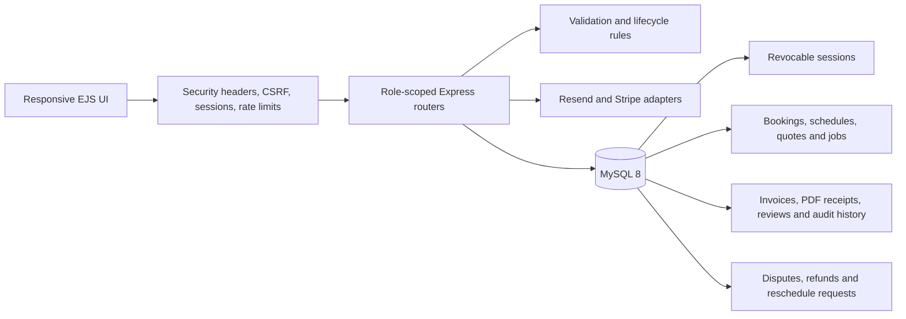
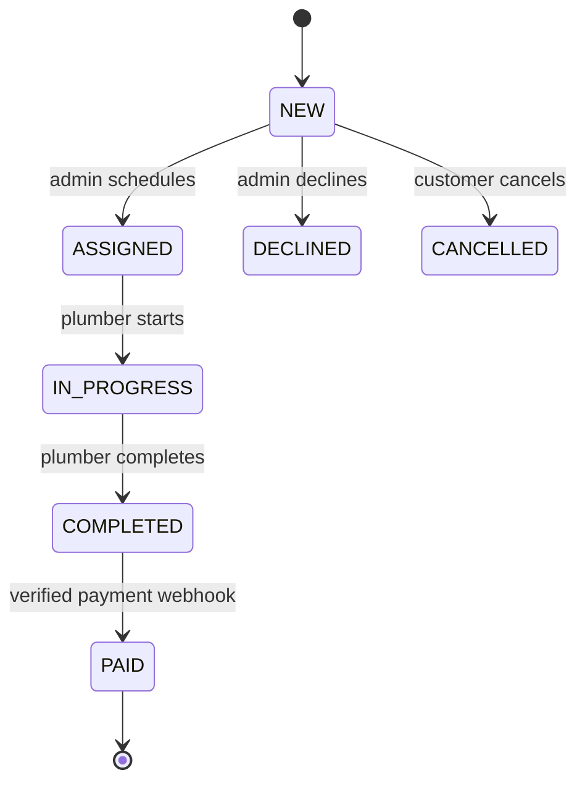

# Architecture

WeFixIt is a server-rendered modular monolith. It keeps deployment simple while
still separating HTTP routes, domain rules, persistence, and presentation.

## Roles and boundaries

- Customers own requests, approve quotes, confirm completed work, pay, and review.
- Plumbers manage availability, assigned work, evidence, notes, and quotes.
- Administrators verify plumbers, schedule jobs, manage accounts, and triage enquiries,
  disputes, reschedules, and provider-backed refunds.
- Every protected route verifies both authentication and the required role server-side.

## Booking lifecycle

Invalid transitions return `409 Conflict`; updates record the actor, prior state,
new state, time, and note in `booking_status_history`.

## Security decisions

- Authentication uses one server-side session model stored in MySQL.
- Passwords use bcrypt; reset and verification tokens are random and stored only as hashes.
- State-changing browser requests require a session-bound CSRF token.
- Login, registration, contact, and reset operations are rate-limited.
- Uploads are size-, extension-, MIME-, and file-signature-limited; secrets stay in environment variables.
- CSP, anti-framing, content-type, referrer, permissions, and production HSTS headers are applied centrally.
- Stripe is authoritative through signed, idempotent webhooks. Simulation is opt-in for demos.

## Data model

The migration in `database/migrations/001_initial_schema.sql` is the source of truth.
Core relationships are `users -> bookings -> quotes/invoices/reviews`, with separate
tables for preferred dates, availability, status history, job notes, photos, notifications,
and completion confirmation.

## Operational model

- `/health/live` verifies the process; `/health/ready` verifies database access.
- `npm run db:migrate` applies ordered, recorded migrations.
- Docker Compose starts MySQL, runs migrations once, and then starts the app.
- CI performs migration and schema checks, formatting, linting, tests, both role and full-lifecycle
  smoke tests, and dependency auditing.
